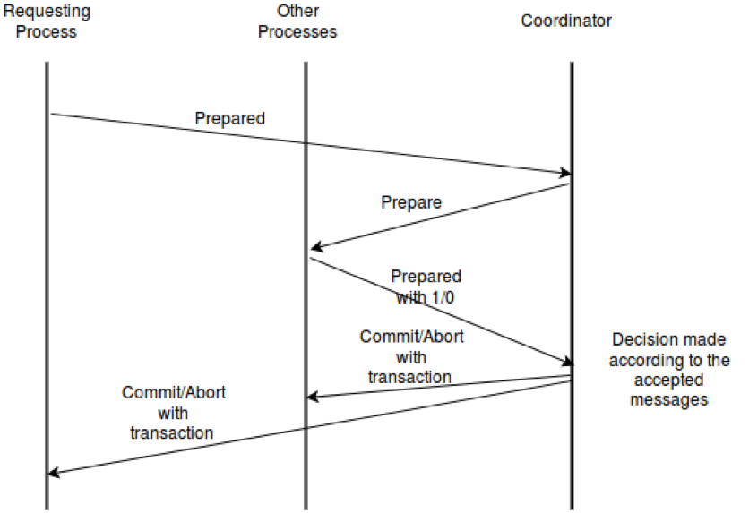

## 2PC Protocol-
### Design-
First requested node will get the transaction to be performes as a input string from the user.Then the transaction string is sent to coordinator with prepared tagged message. After getting the prepared message coordinator will ask other nodes to prepare with prepare message.Other nodes will send prepared message with either 0 or 1 bit, showing their agreement or disagreement. Prepared with 0 represents disagreement and prepared with 1 represents agreement.If all other processes agree for prepared then only coordinator sends the commit message containign the transaction request string to every other process otherwise it sends commit with bit 0 embedded in it that represents abort operation.
After getting the commit message, every process performs the transaction in store.txt file and commits.Or else getting the abort message transaction is aborted.  

if(coordinator)
{
receive prepared from requesting process
send prepare to other processes
receive prepared from other processes
send commit to requesting process
send commit to other proces
}
else if(requesting process)
{
take transaction as input
send prepared to coordinator
receive commit from coordinator
do commit
}
else(other processes)
{
receive prepare from coordinator
send prepared to coordinator
receive commit from coordinator
do commit
}

## 3PC Protocol-
### Design
First requested node will get the transaction to be performes as a input string from the user.Then the transaction string is sent to coordinator with prepared tagged message. After getting the prepared message coordinator will ask other nodes to prepare with prepare message.Other nodes will send prepared message with either 0 or 1 bit, showing their agreement or disagreement. Prepared with 0 represents disagreement and prepared with 1 represents agreement.
If all other processes agree for prepared then only coordinator sends the precommit message  containing message bit 1 to every other process otherwise it sends precommit with bit 0 embedded in it that represents abort operation to all other processes including the requesting process and every process gets aborted.
After getting precommit message with bit value 1, the other processes sends acknowledgement message with agreement or disagrrement. Acknowledgement message with 0 represents disagreement and  with 1 represents agreement.
If all other processes sends acknowledgement (ack tagged message with bit 1) then only coordinator sends commit message with the transaction request to all the processes. Otherwise else coordinator sends abort message to all the processes.
After getting the commit message with transaction string, every process performs the transaction in store.txt file and commits.Or else If they receive the abort message (commit tagged message with bit 0)then transaction is aborted.   

if(coordinator)
{
receive prepared from requesting process
send prepare to other processes
receive prepared from other processes
send precommit to other processes
receive acknowledgement from other processes
send commit to requesting process
send commit to other proces
}
else if(requesting process)
{
take transaction as input
send prepared to coordinator
receive commit from coordinator
do commit
}
else(other processes)
{
receive prepare from coordinator
send prepared to coordinator
receive precommit from coordinator
send acknoledgement to coordinator
receive commit from coordinator
do commit
}

## Byzantine Agreement Protocol-
### Design
First requested node will get the transaction to be performes as a input string from the user.Then the transaction string is sent to coordinator with prepared tagged message. After getting the prepared message coordinator will ask other nodes to prepare with prepare message.Other nodes will send prepared message with either 0 or 1 bit, showing their agreement or disagreement. Prepared with 0 represents disagreement and prepared with 1 represents agreement.
All getting all the bits coordinator decides for one bit according to the majority and sends it to all the processes to perform byzantine.
All the processes execute byzantine protocol to reach a common agreement for deciding final decision bit. In step 1, the bits are sent by all the processes to all other processes except the coordinator.then the bits are received by all the processes. Among the received bits majority bits are found out.thus obtained bit is again sent to all other processes and this loops untill (faulty_processes+1) times.
After executing byzantine the common agreed bit will be sent to the coordinator by all the processes.  
After receiving final decision bits If all other processes agreed on 1 then only coordinator sends the commit message containign the transaction request string to every other process otherwise it sends commit with bit 0 embedded in it that represents abort operation.
After getting the commit message, every process performs the transaction in store.txt file and commits.Or else getting the abort message transaction is aborted.  

if(coordinator)
{
receive prepared from requesting process
send prepare to other processes
receive prepared from other processes
send byz_start to all other processes
receive byz_end from all other processes
send commit to requesting process
send commit to other proces
}
else if(requesting process)
{
take transaction as input
send prepared to coordinator
receive byz_start from coordinator
loop untill m+1 times
      send majority bit to all other processes
      receive bit from all other processes
      find majority bit
send byz_end to coordinator
receive commit from coordinator
do commit
}
else(other processes)
{
receive prepare from coordinator
send prepared to coordinator
receive byz_start from coordinator
loop untill m+1 times
      send majority bit to all other processes
      receive bit from all other processes
      find majority bit
send byz_end to coordinator
receive commit from coordinator
do commit
}

